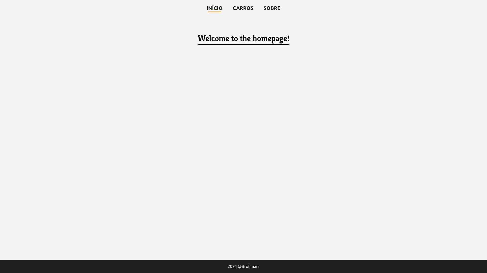
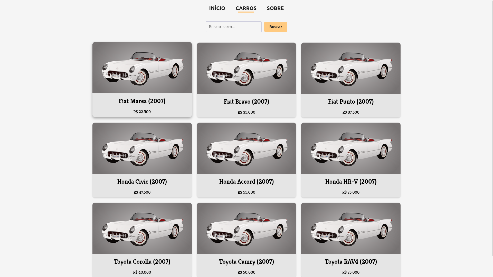
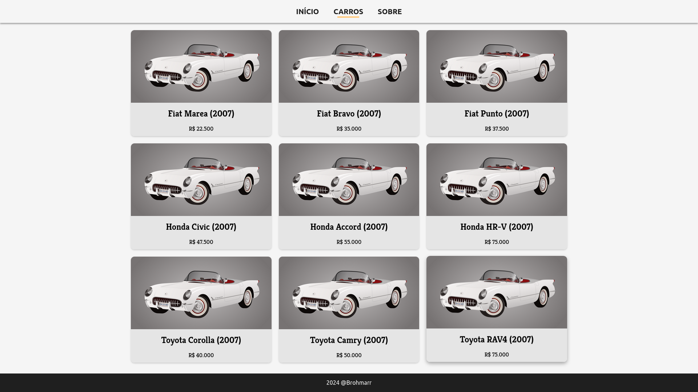

# Django Car Store

A simple website for a car store made with the Django framework.

## Requirements

* Python (3.12.5)
* Packages listed in [requirements.txt](requirements.txt), that can be installed with the following command:
    * ```pip install -r requirements.txt```

## Usage

* Clone this repository and cd into it in the terminal;
* Run the following command and click ("CTRL" + "Left Mouse Button") the localhost link to test the project (you'll be automatically redirected to the homepage).
    * ```python manage.py runserver```

## Screenshots

Here's a list of currently available pages of the website.

### Home



### Cars





### About


